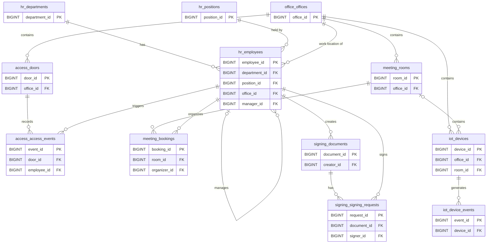

# Source Relationships

```mermaid
erDiagram
    %% HR Domain
    hr_departments {
        BIGINT department_id PK
    }
    hr_positions {
        BIGINT position_id PK
    }
    hr_employees {
        BIGINT employee_id PK
        BIGINT department_id FK
        BIGINT position_id FK
        BIGINT office_id FK
        BIGINT manager_id FK
    }

    hr_departments ||--o{ hr_employees : "has"
    hr_positions ||--o{ hr_employees : "held by"
    hr_employees |o--o{ hr_employees : "manages"

    %% Office Domain
    office_offices {
        BIGINT office_id PK
    }
    office_offices ||--o{ hr_employees : "work location of"

    %% Access Domain
    access_doors {
        BIGINT door_id PK
        BIGINT office_id FK
    }
    access_access_events {
        BIGINT event_id PK
        BIGINT door_id FK
        BIGINT employee_id FK
    }
    office_offices ||--o{ access_doors : "contains"
    access_doors ||--o{ access_access_events : "records"
    hr_employees ||--o{ access_access_events : "triggers"

    %% Meeting Domain
    meeting_rooms {
        BIGINT room_id PK
        BIGINT office_id FK
    }
    meeting_bookings {
        BIGINT booking_id PK
        BIGINT room_id FK
        BIGINT organizer_id FK
    }
    office_offices ||--o{ meeting_rooms : "contains"
    meeting_rooms ||--o{ meeting_bookings : "has"
    hr_employees ||--o{ meeting_bookings : "organizes"

    %% Signing Domain
    signing_documents {
        BIGINT document_id PK
        BIGINT creator_id FK
    }
    signing_signing_requests {
        BIGINT request_id PK
        BIGINT document_id FK
        BIGINT signer_id FK
    }
    hr_employees ||--o{ signing_documents : "creates"
    signing_documents ||--o{ signing_signing_requests : "has"
    hr_employees ||--o{ signing_signing_requests : "signs"

    %% IoT Domain
    iot_devices {
        BIGINT device_id PK
        BIGINT office_id FK
        BIGINT room_id FK
    }
    iot_device_events {
        BIGINT event_id PK
        BIGINT device_id FK
    }
    office_offices ||--o{ iot_devices : "contains"
    meeting_rooms |o--o{ iot_devices : "contains"
    iot_devices ||--o{ iot_device_events : "generates"
```
